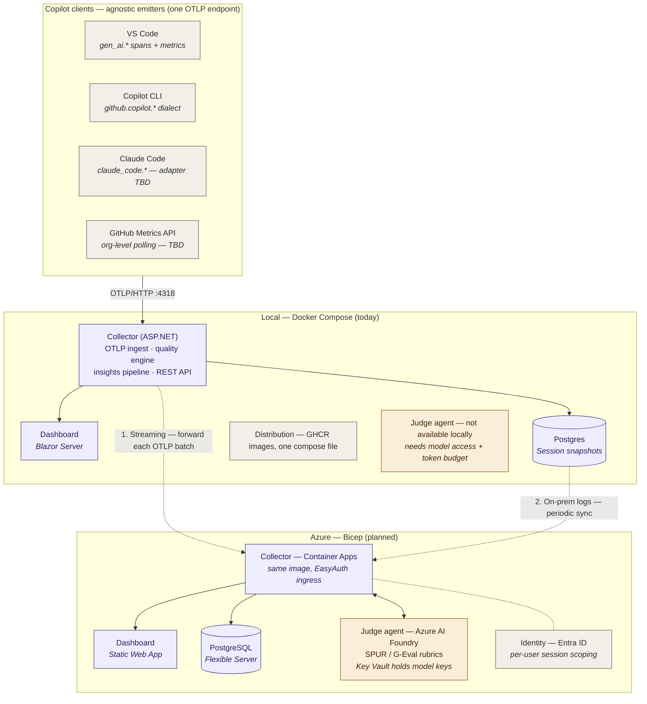

# CopilotScope

[](https://github.com/konradcinkusz/copilotscope/actions/workflows/build-containers.yml)
[](https://github.com/konradcinkusz/copilotscope/releases/latest/download/CopilotScope_Quality_Framework.pdf)
[](LICENSE)
[](https://github.com/konradcinkusz/copilotscope/releases/latest)
[](https://github.com/konradcinkusz/copilotscope/releases)
[](https://github.com/konradcinkusz/copilotscope/stargazers)
[](https://github.com/konradcinkusz/copilotscope#quick-start--no-clone-just-pull)
[](https://dotnet.microsoft.com/download/dotnet/8.0)

Observability for **GitHub Copilot** chat sessions: an OpenTelemetry collector, a
Postgres store and a Blazor dashboard with a real-time session quality score —
orchestrated with **.NET Aspire**.

```
                          ┌───────────────── .NET Aspire AppHost ─────────────────┐
VS Code / Copilot CLI     │  Collector :4318 ──▶ Postgres (container + volume)    │
    ──OTLP/HTTP──────────▶│   (ingest + API) ◀── Dashboard (Blazor Server)        │
                          │                      pgAdmin (browse the data)        │
                          └───────────────────────────────────────────────────────┘
```

## Projects

| Project | Role | NuGet deps |
|---|---|---|
| `src/CopilotScope.AppHost` | Aspire orchestration: Postgres + pgAdmin containers, wiring | Aspire.Hosting.* 9.3 |
| `src/CopilotScope.Collector` | OTLP/HTTP ingest (in-repo protobuf decoder), session aggregation, quality scoring, turn analysis, API, persistence | Npgsql only |
| `src/CopilotScope.Dashboard` | Blazor Server UI: sessions, quality VU-meter, turn analysis, prompt transcript, delete | **zero** |
| `tests/CopilotScope.Tests` | xUnit unit tests (decoder, routing, quality, turns, persistence roundtrip) | xunit |
| `tools/CopilotScope.TelemetryGen` | realistic demo telemetry generator (incl. gzip + captured content) | zero |
| `tools/CopilotScope.Seeder` | pushes a batch of comprehensive demo/local sessions into a running collector via `/api/admin/seed` | zero |

## Quick start — no clone, just pull

Each GitHub release publishes two images to GHCR (see `.github/workflows/build-containers.yml`).
Users don't need the repository at all:

```bash
# Durable (Postgres + collector + dashboard) — download ONE file, no clone:
# Linux / macOS / Git Bash:
curl -O https://raw.githubusercontent.com/konradcinkusz/copilotscope/master/docker-compose.ghcr.yml
# Windows PowerShell:
curl.exe -O https://raw.githubusercontent.com/konradcinkusz/copilotscope/master/docker-compose.ghcr.yml
docker compose -f docker-compose.ghcr.yml up
```

One-time setup after the first workflow run: GHCR packages start private —
switch each package to **public** (GitHub → Packages → package → Settings)
so anonymous `docker pull` works.

## Quick start — from source

Requirements: .NET 8 SDK + Docker. No workloads — Aspire 9 comes via NuGet.

```bash
dotnet run --project src/CopilotScope.AppHost
```

Aspire starts Postgres (named volume `copilotscope-pgdata`), **pgAdmin** (browse
the `sessions` table from the Aspire dashboard), the collector pinned to
`http://localhost:4318` and the dashboard. F5 on the AppHost project does the
same with the debugger attached to everything.

Then enable OTel in VS Code (full walkthrough for every Copilot surface,
including CLI and troubleshooting: **docs/TUTORIAL.md**):

```jsonc
{
  "github.copilot.chat.otel.enabled": true,
  "github.copilot.chat.otel.otlpEndpoint": "http://localhost:4318",
  "github.copilot.chat.otel.captureContent": true   // optional: prompt/response preview
}
```

Demo without Copilot — one realistic session played over real OTLP/HTTP (exercises the
actual ingest/decoder path):

```bash
dotnet run --project tools/CopilotScope.TelemetryGen -- http://localhost:4318 my-session
```

Seed a whole dataset instead — a handful of sessions for a fresh local run, or a big
varied set (different personas: clean, error-prone, laggy, rejected-edits, frustrated,
internal helper calls, ...) for a demo/presentation. Pushes straight into a **running**
collector via `POST /api/admin/seed`, no OTLP encoding and no restart needed; always
clears any previously seeded data first, so re-running never piles up duplicates:

```bash
# quick: ~6 sessions, for local first-run sanity checks
dotnet run --project tools/CopilotScope.Seeder -- quick

# demo: a big multi-day dataset for presentations (default profile)
dotnet run --project tools/CopilotScope.Seeder -- demo http://localhost:4318 --days 14
```

Tests:

```bash
dotnet test
```

## Where the data lives

In **Postgres** (container managed by the AppHost, data on a named volume). Table
`sessions`: key `id` (= `gen_ai.conversation.id`), queryable columns
(`last_seen`, `quality_score`, `quality_grade`) plus the full session state as a
**jsonb snapshot** — counters, TTFT samples, tool stats, per-turn aggregates,
edits, feedback, the event tail and the captured transcript.

Write path: ingest marks sessions dirty, `PersistenceWriter` upserts them once
per second (telemetry bursts ≠ write storms). On startup the collector
**rehydrates** sessions from the database. A Postgres outage degrades to
in-memory and never blocks ingest.

`POST /api/admin/seed` takes the same route into a **running** collector:
`tools/CopilotScope.Seeder` builds full session snapshots and posts them there
directly, so seeding never needs a database connection of its own or a restart
to show up. Seeded rows are namespaced under the `seed-` id prefix, so a reset
(`{"reset": true}`, the seeder's default) only ever clears its own data.

**What about full chat content?** By default Copilot sends metadata only. With
`captureContent` enabled, prompt/response text arrives in span attributes and
CopilotScope stores it in the snapshot (bounded to the last 100 entries, each
truncated at 4 000 chars) — enough to review a session later, not a verbatim
archive. For a complete raw-telemetry archive, use the forwarder to a full
backend.

## Session quality

Two complementary views:

**Composite score 0–100** (`QualityEngine` v2): reliability 0.25 (squared
error-free rate) · acceptance 0.20 · **friction 0.20** (mean TFRA turn score) ·
latency 0.15 · feedback 0.10 · efficiency 0.10. Only components with actual
data enter the composite — weights are renormalized across them, so a session
without edit/feedback telemetry is scored on what it *did* produce instead of
being pinned near a neutral prior (the v1 behavior that made every session look
like an 80). Confidence = data coverage × sample ramp. Thresholds: ≥85
excellent, ≥70 good, ≥55 fair, ≥40 poor.

**Turn analysis (TFRA)** (`SegmentAnalyzer`): every `invoke_agent` trace is one
turn; each turn is scored for friction — LLM/tool errors, latency vs. *this
session's* median TTFT, repair loops (tool-call bursts with failures). The
dashboard highlights the best and worst turn **with reasons**.

### Evaluation algorithms — implementation status

Two axes now: **implementation status** (are the components there?) and **deployment scope** (does the algorithm work in the local-only setup, or does it require the cloud deployment with the judge agent?). Local means the analyzer runs entirely on-machine with no external services. Cloud means it depends on the Azure-provisioned judge agent (LLM access, model keys in Key Vault, per-user auth).

| # | Algorithm | Status | Local | Cloud | Where |
|---|---|---|---|---|---|
| 1 | LLM-as-a-Judge (G-Eval) | ❌ not implemented | ❌ | ✅ planned | needs the cloud judge agent (Azure AI Foundry) — model access, prompt budget, per-user auth |
| 2 | SPUR (learned satisfaction rubrics) | ❌ not implemented | ❌ | ✅ planned | needs the judge agent to run the learned rubric and labelled sessions for calibration |
| 3 | RAG component metrics (RAGAS) | ❌ not implemented | ❌ | ✅ planned | needs the judge agent plus captured retrieval context; only meaningful for retrieval-based Copilot flows |
| 4 | Edit Survival Analysis | ✅ **full** | ✅ | ✅ | `EditSurvivalAnalyzer` — four-gram & no-revert split (0.4/0.6); also feeds the *acceptance* component |
| 5 | Acceptance-weighted throughput | ✅ **full** | ✅ | ✅ | `ThroughputAnalyzer` — accepted LOC/turn, LOC per 1k output tokens, rejection-discounted |
| 6 | Turn-level Friction & Repair (TFRA) | ✅ **full** | ✅ | ✅ | `SegmentAnalyzer` (Turn analysis panel) + *friction* component in the composite |
| 7 | Latency-utility model | ✅ **full** | ✅ | ✅ | `LatencyUtilityAnalyzer` — per-sample utility curve, >2 s / >8 s risk buckets; simplified form also as the *latency* component |
| 8 | Token & cache economics | ✅ **full** | ✅ | ✅ | `TokenEconomicsAnalyzer` — per-model cost (`CopilotScope:Pricing`), cache savings, cost per turn / accepted edit |
| 9 | Frustration classification | ✅ **simplified** (local) · 🔜 **deep** (cloud) | ✅ heuristic | 🔜 planned | Local: `FrustrationAnalyzer` — EN/PL lexicon + rephrasing (Jaccard) + typography, **report-only**. Cloud: deep classifier via the judge agent (sarcasm-aware, context-grounded), promoted into the composite once validated |
| 10 | Task-completion detection | ❌ not implemented | ⚠️ partial | ✅ planned | Local partial: hooks for external completion signals (build/test exit codes) via the ingest API. Cloud full: judge agent reasons about "did the user's ask get resolved" from transcript + tool outcomes |

Analyzers #4–#9 (local column) run as a pluggable insight pipeline (`Quality/Insights.cs`): one `IInsightAnalyzer` class + one DI registration = a new algorithm, zero UI work. Cloud-only analyzers (#1–#3, plus the deep variants of #9/#10) implement the same `IInsightAnalyzer` interface but call out to the Azure AI Foundry judge agent; they register only when the collector is deployed with judge configuration enabled, so a local-only setup shows them as "no-data" with a `"requires cloud deployment"` note rather than an error. Full survey with design rationale: `docs/ANALYSIS.md` §8–8b (Polish).
## Deployment options

| Mode | Command | Containers |
|---|---|---|
| Dev (Aspire) | `dotnet run --project src/CopilotScope.AppHost` | postgres, pgadmin |
| Compose | `docker compose up --build` | postgres, collector, dashboard |
| **GHCR (durable)** | see "Quick start — no clone, just pull" above | postgres, collector, dashboard |
| Azure Container Apps | `infra/main.bicep` | collector (+ your PG) |

In Production mode `/v1/*` requires `x-api-key` (`CopilotScope__Ingest__ApiKey`);
clients add it via `OTEL_EXPORTER_OTLP_HEADERS="x-api-key=<secret>"`.

## Collector API

| Endpoint | Description |
|---|---|
| `POST /v1/traces` `/v1/metrics` `/v1/logs` | OTLP/HTTP ingest (protobuf; gzip/deflate supported) |
| `GET /api/sessions` | session list with quality scores |
| `GET /api/sessions/{id}` | details: tools, errors, events, transcript, turn analysis |
| `GET /api/overview` | cross-session summary: total token burn, per-model calls, daily usage, top sessions |
| `DELETE /api/sessions/{id}` | remove a session (memory + Postgres) |
| `GET /api/health` | health incl. persistence status |

## Dashboard pages

- **Sessions** (`/`) — live session list, quality VU-meter, turn analysis with
  best/worst reasons, prompt transcript, delete control.
- **Overview** (`/overview`) — everything you burned across all chats: total
  input/output/cache tokens, tokens per day, calls per model, top sessions by
  token burn, average quality.
- **Docs** (`/docs`) — built-in deep documentation: what every tile and score
  component means, the rationale (and honest objections) behind each insight
  algorithm, content-capture semantics and known limitations.

## Copilot CLI in one command

```powershell
.\scripts\Enable-CopilotOtel.ps1                  # metadata only
.\scripts\Enable-CopilotOtel.ps1 -CaptureContent  # + prompt/response content
copilot                                           # run from the SAME terminal
```

Heads-up: `COPILOT_OTEL_CAPTURE_CONTENT` is **not a real variable** — the CLI
follows the OTel GenAI standard `OTEL_INSTRUMENTATION_GENAI_CAPTURE_MESSAGE_CONTENT=true`,
which is what the script sets.

## Architecture

Copilot clients (VS Code, Copilot CLI, Claude Code, GitHub Metrics API) are
agnostic to the deployment — they emit OpenTelemetry to **one OTLP endpoint**,
which in the basic setup is the local collector. From there sessions can stay
on the developer's machine, be streamed upstream to Azure in near real time, or
be batch-synced from Postgres after the fact. The Azure deployment (Bicep,
planned) provisions the same collector image plus an LLM **judge agent** that
grades sessions using SPUR/G-Eval rubrics — a class of insights that requires
model access and is deliberately unavailable in the local-only setup.


<details>
<summary>Diagram source (Mermaid — edit here, re-export SVG)</summary>


</details>

## Design notes

- The OTLP protobuf decoder is written in-repo (field numbers verified against
  the official OpenTelemetry `.proto` files) — the collector doesn't pull the
  OTel SDK.
- The dashboard polls the collector API every 2 s (zero extra packages);
  swapping in the SignalR client is a one-class change if push is ever needed.
- Ingest accepts OTLP/HTTP protobuf only (Copilot's default); JSON gets a 415
  with a configuration hint. Compressed bodies are decompressed transparently.
- Architecture analysis with diagrams (in Polish): `docs/ANALYSIS.md`.

## License

MIT — see [LICENSE](LICENSE).
