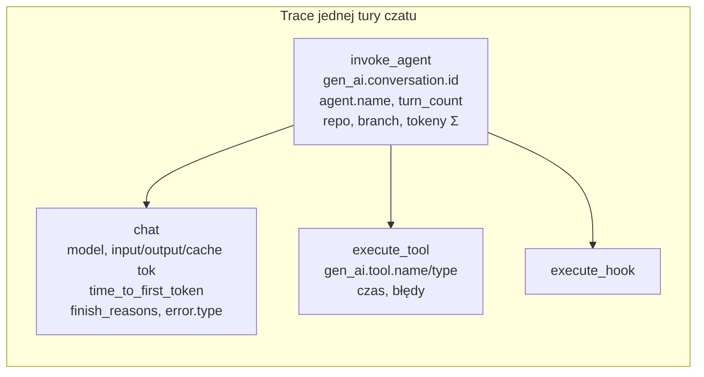
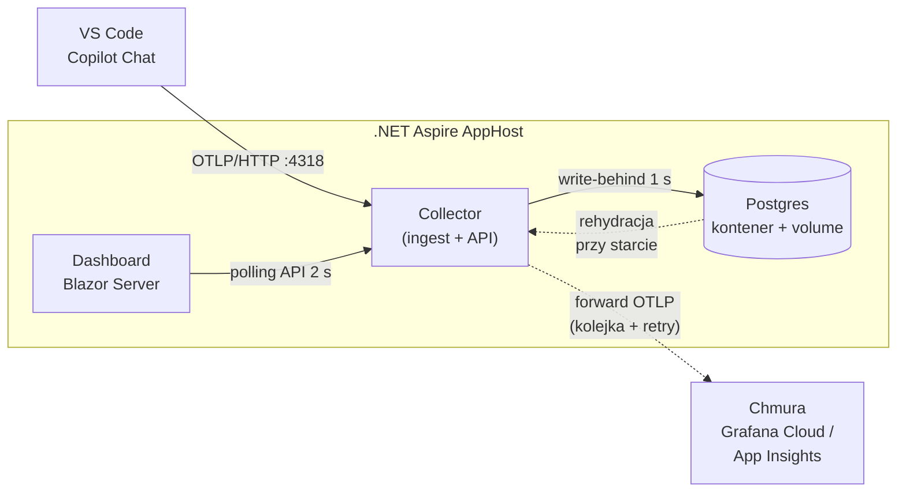
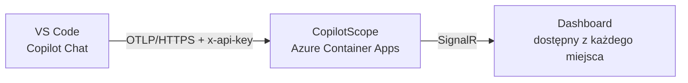
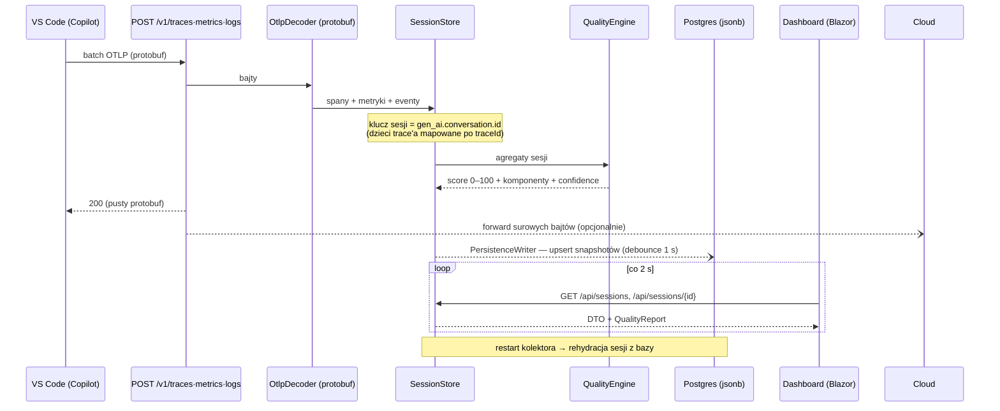
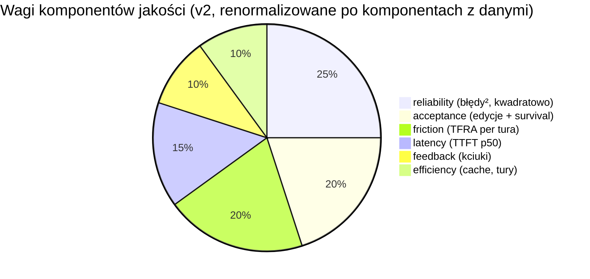

# CopilotScope — analiza: obserwowalność sesji GitHub Copilot przez OpenTelemetry

## 1. Czy to wykonalne?

**Tak, oba warianty.** Copilot Chat w VS Code ma natywny eksport OpenTelemetry (traces, metrics, log events) zgodny z konwencjami semantycznymi OTel GenAI. Włącza się go w settings.json:

| Ustawienie | Znaczenie | Domyślnie |
|---|---|---|
| `github.copilot.chat.otel.enabled` | włącza eksport | `false` |
| `github.copilot.chat.otel.otlpEndpoint` | dokąd wysyłać | `http://localhost:4318` |
| `github.copilot.chat.otel.exporterType` | `otlp-http` (protobuf) / `otlp-grpc` / `console` / `file` | `otlp-http` |
| `github.copilot.chat.otel.captureContent` | treść promptów/odpowiedzi w spanach | `false` |
| `github.copilot.chat.otel.maxAttributeSizeChars` | limit rozmiaru atrybutu | — |

Zmienne środowiskowe mają priorytet nad settings: `COPILOT_OTEL_ENABLED`, `COPILOT_OTEL_ENDPOINT`, `OTEL_EXPORTER_OTLP_ENDPOINT`, `OTEL_EXPORTER_OTLP_HEADERS` (auth!), `OTEL_RESOURCE_ATTRIBUTES`. W środowisku enterprise te ustawienia można wymusić centralnie (managed settings przez MDM — changelog GitHub z 2026-07-08).

## 2. Jakie sygnały wysyła Copilot

**Metryki** (m.in.): `gen_ai.client.token.usage`, `gen_ai.client.operation.duration`, `copilot_chat.tool.call.count/duration`, `copilot_chat.agent.turn.count`, `copilot_chat.time_to_first_token`, `copilot_chat.edit.acceptance.count`, `copilot_chat.lines_of_code.count`, `copilot_chat.edit.survival.four_gram/no_revert`, `copilot_chat.user.feedback.count` (kciuki).

**Eventy (logi)**: `copilot_chat.session.start`, `copilot_chat.user.feedback`, `copilot_chat.edit.feedback`, `copilot_chat.agent.turn`, `copilot_chat.tool.call`.

**Resource**: `service.name=copilot-chat`, `session.id` (per okno VS Code).

Źródła: dokumentacja VS Code "Monitoring agents", repo `microsoft/vscode-copilot-chat` (docs/monitoring), changelog GitHub (enterprise managed OTel export), blog OTel o GenAI observability.

## 3. Dwa warianty architektury

### Wariant A — orkiestracja lokalna (.NET Aspire) + opcjonalny forward do chmury

### Wariant B — telemetria bezpośrednio do chmury

### Porównanie

| Kryterium | A: kolektor lokalny | B: bezpośrednio do chmury |
|---|---|---|
| Latencja dashboardu | ~0 (localhost) | zależna od sieci |
| Praca offline | ✅ pełna | ❌ brak telemetrii bez sieci |
| Prywatność | dane zostają lokalnie; do chmury tylko to, co świadomie forwardujesz | wszystko od razu opuszcza maszynę |
| Autoryzacja | zbędna | konieczna (`OTEL_EXPORTER_OTLP_HEADERS`) |
| Utrzymanie | proces lokalny (dotnet run / usługa) | kontener w chmurze |
| Wiele maszyn / zespół | każdy swój kolektor | ✅ jeden wspólny dashboard |

**Rekomendacja:** wariant A z opcjonalnym forwardem — dashboard działa natychmiast i offline, a chmura dostaje kopię danych, gdy jest osiągalna (bounded queue + retry z backoffem, awaria chmury nie blokuje lokalnej pracy). Wariant B ma sens dla zespołu/enterprise z centralnym dashboardem; ta sama binarka CopilotScope obsługuje oba tryby.

## 4. Przepływ danych i ocena jakości w czasie rzeczywistym

### Model oceny (0–100, ważona suma z priorem)

**v2**: komponenty bez danych są raportowane, ale **nie wchodzą do składanej sumy** — wagi renormalizują się po komponentach z próbkami. To naprawia spłaszczenie z v1, gdzie prior 0.7 przy pełnej wadze przybijał każdą typową sesję (bez telemetrii edits/feedbacku) do ~80. Dodatkowo błędy karane są kwadratowo, a nowy komponent *friction* wciąga do składanej oceny wynik analizy tur (TFRA).

Każdy komponent zwraca wartość 0–1 i liczbę próbek; przy małej liczbie próbek wynik jest mieszany z priorem 0.7, a `confidence` raportu rośnie z ilością danych. Progi: ≥85 *excellent*, ≥70 *good*, ≥55 *fair*, ≥40 *poor*, poniżej — *critical*.

## 5. Decyzje techniczne

- **Orkiestracja .NET Aspire (AppHost)** — Postgres jako kontener z named volume, kolektor na stałym, nieproxowanym porcie 4318 (VS Code zawsze celuje w `localhost:4318`), dashboard z `WithReference(collector)` + `WaitFor`. F5 na AppHost podnosi całość z debugerem.
- **Persystencja: Postgres, tabela `sessions`** — pełny stan sesji jako jsonb snapshot + kolumny `quality_score`/`last_seen` do zapytań. Write-behind z debounce 1 s, rehydracja przy starcie; awaria bazy degraduje do in-memory i nie blokuje ingestu. Surowe spany OTLP celowo nie są persystowane — od trwałej, pełnej telemetrii jest forward do backendu chmurowego.
- **Frontend: Blazor Server bez pakietów NuGet** — komponenty renderowane serwerowo, odświeżanie pollingiem 2 s przez API kolektora; endpoint kolektora rozwiązywany z env `services__collector__http__0` wstrzykiwanego przez Aspire, z fallbackiem na localhost (aplikacja działa też solo).
- **Minimalna powierzchnia zależności** — kolektor: tylko Npgsql; dashboard i generator: zero. Własny czytnik protobuf wire-format z numerami pól zweryfikowanymi względem oficjalnych `.proto` z `open-telemetry/opentelemetry-proto`.
- **Tryby**: `Development` (AppHost, bez auth) vs `Production` (docker-compose / ACA, wymagany `x-api-key` na `/v1/*`).
- **captureContent domyślnie wyłączone po stronie Copilota** — dashboard pokazuje metadane (tokeny, czasy, narzędzia, błędy), nie treść rozmów; URL repozytorium jest anonimizowany z credentiali.

## 6. Ograniczenia

- Ingest wyłącznie OTLP/HTTP protobuf (domyślny tryb Copilota); gRPC i JSON pominięte świadomie (415 z komunikatem).
- Snapshot jsonb przechowuje agregaty i ogon zdarzeń; pełna historia surowych spanów wymaga forwardu do dedykowanego backendu.
- Legacy metryki `copilot_chat.*` są dual-emitowane równolegle do konwencji `gen_ai.*` — kolektor rozumie oba zestawy nazw.

## 7. Uniwersalność telemetrii — które Copiloty to obsługują?

Telemetria OTel **nie jest** cechą "GitHub Copilota" jako całości — jest cechą konkretnych hostów agenta:

| Powierzchnia | Eksport OTel | Konfiguracja |
|---|---|---|
| VS Code (Copilot Chat) | ✅ pełny (traces/metrics/events) | settings.json / env / managed settings |
| Copilot CLI (terminal) | ✅ (tylko otlp-http; grpc po cichu spada na HTTP) | `COPILOT_OTEL_ENABLED`, `OTEL_EXPORTER_OTLP_ENDPOINT` |
| Copilot SDK (JS/Py/Go/.NET/Java/Rust) | ✅ | `TelemetryConfig { OtlpEndpoint }` |
| Agenty Claude wewnątrz VS Code | ✅ | te same ustawienia VS Code |
| Copilot coding agent (github.com) | ➖ | działa na infrze GitHuba; nie wysyła OTLP do własnego kolektora |
| **Visual Studio (2022/2026)** | ❌ (stan: lipiec 2026) | brak |
| Wtyczki JetBrains / Xcode / Eclipse | ❌ (stan: lipiec 2026) | brak |
| Copilot Studio (Power Platform) | ➖ | spany OTel-aligned, ale wyłącznie do Application Insights |

Sygnały idą w trzech przestrzeniach nazw: `gen_ai.*` (konwencje OTel GenAI — na nich opiera się CopilotScope), `github.copilot.*` (kanoniczne dla CLI, od niedawna też VS Code) i legacy `copilot_chat.*` (dual-emit bezterminowo). Kolektor rozumie klucze gen_ai + copilot_chat, więc **każde narzędzie zgodne z konwencjami OTel GenAI** (nie tylko Copilot — także aplikacje instrumentowane OpenLLMetry/OpenLIT itp.) wyląduje na dashboardzie z sensownymi metrykami; specyficzne dla Copilota sygnały (edit survival, kciuki) po prostu pozostaną puste.

## 8. Ocena jakości sesji czatu — przegląd 10 podejść

Wynik researchu (arXiv 2403.12388 SPUR, praktyki Microsoft/GitHub, ekosystem eval LLM):

1. **LLM-as-a-Judge (G-Eval)** — model-sędzia ocenia transkrypt wg rubryki (poprawność, kompletność, styl). Najbogatszy sygnał; wymaga treści rozmowy, drugiego modelu i budżetu na tokeny; podatny na bias sędziego.
2. **SPUR (Supervised Prompting for User satisfaction Rubrics)** — LLM uczy się interpretowanych rubryk SAT/DSAT z oznaczonych sesji i punktuje nowe rozmowy; stan sztuki w szacowaniu satysfakcji (badane m.in. na Bing Copilot).
3. **Metryki komponentowe RAG (RAGAS)** — faithfulness / answer relevance / context precision; sensowne, gdy sesja opiera się na retrieval; wymaga treści.
4. **Edit Survival Analysis** — mierzy, ile wygenerowanego kodu *przeżywa* w czasie (4-gram overlap, no-revert po 30/300 s). GitHub emituje to natywnie (`copilot_chat.edit.survival.*`) — najmocniejszy sygnał "kod był naprawdę użyteczny".
5. **Acceptance-weighted throughput** — zaakceptowane linie/edycje na interakcję, ważone odrzuceniami; prosty proxy produktywności.
6. **Turn-level Friction & Repair Analysis (TFRA)** — segmentacja sesji na tury (trace `invoke_agent`) i punktacja każdej: błędy LLM/narzędzi, latencja względem mediany *tej* sesji, pętle naprawcze (seria tool-calli z błędami = agent kręci się w kółko). Interpretowalna, działa na samych metadanych.
7. **Latency-utility model** — TTFT/e2e mapowane na użyteczność krzywą log-linear (opóźnienie ↔ porzucanie odpowiedzi); komponent latency w CopilotScope to uproszczenie tego podejścia.
8. **Ekonomia tokenów i cache** — outcome na token, cache-hit ratio, koszt sesji; wykrywa rozdęte konteksty i marnotrawstwo.
9. **Klasyfikacja frustracji użytkownika** — sygnały językowe w promptach (powtórzenia, przeformułowania, wykrzykniki, "no, that's wrong"); wymaga treści; dobrze koreluje z DSAT.
10. **Task-completion detection** — wyodrębnienie celu sesji i weryfikacja domknięcia (build przeszedł, testy zielone, edycje zapisane bez rewertów); najbliższe "czy praca została wykonana", najtrudniejsze do automatyzacji.

**Zaimplementowano: #6 (TFRA)** — `Quality/SegmentAnalyzer.cs`. Wybór celowy: działa wyłącznie na metadanych (zero treści promptów, zero modelu-sędziego, zero sieci), jest interpretowalny z konstrukcji (każda tura dostaje score 0–1 **i listę powodów**), a latencję ocenia względem mediany własnej sesji, więc nie karze wolnych modeli — tylko tury odstające. Wynik zasila panel "Turn analysis" (najlepsza/najgorsza część czatu + dlaczego) i uzupełnia istniejący złożony wskaźnik 0–100 (który sam w sobie jest meta-podejściem: ważona kompozycja #4, #5, #7, #8 z priorem i confidence).

### 8a. Macierz implementacji algorytmów

| # | Algorytm | Status w CopilotScope | Gdzie / dlaczego nie |
|---|---|---|---|
| 1 | LLM-as-a-Judge (G-Eval) | ❌ nie zaimplementowany | wymaga modelu-sędziego, treści rozmów i budżetu na tokeny |
| 2 | SPUR (rubryki satysfakcji) | ❌ nie zaimplementowany | wymaga LLM + oznaczonych sesji treningowych |
| 3 | Metryki RAG (RAGAS) | ❌ nie zaimplementowany | dotyczy sesji opartych o retrieval; wymaga treści |
| 4 | Edit Survival Analysis | ✅ **w pełni** | `EditSurvivalAnalyzer` — rozdzielone four_gram/no_revert (0.4/0.6), interpretacja; nadal zasila też komponent acceptance |
| 5 | Acceptance-weighted throughput | ✅ **w pełni** | `ThroughputAnalyzer` — accepted LOC/turę, LOC/1k tokenów out, przepustowość dyskontowana odrzuceniami |
| 6 | **TFRA — Turn-level Friction & Repair** | ✅ **w pełni** | `SegmentAnalyzer` (panel Turn analysis) + komponent **friction** w składanym score |
| 7 | Latency-utility model | ✅ **w pełni** | `LatencyUtilityAnalyzer` — krzywa użyteczności per próbka, progi uwagi >2 s i porzucenia >8 s; uproszczona wersja nadal jako komponent latency |
| 8 | Ekonomia tokenów / cache | ✅ **w pełni** | `TokenEconomicsAnalyzer` — koszt per model (cennik `CopilotScope:Pricing`), oszczędności cache, koszt/turę i /zaakceptowaną edycję |
| 9 | Klasyfikacja frustracji z promptów | ✅ **uproszczony** | `FrustrationAnalyzer` — leksykon EN/PL + Jaccard przeformułowań + sygnały typograficzne; **report-only**, celowo poza składanym score (heurystyka jest zaszumiona) |
| 10 | Task-completion detection | ❌ nie zaimplementowany | wymaga sygnałów domknięcia (build/testy) spoza telemetrii Copilota |

Komponent **feedback** (kciuki) i **reliability** (błędy) leżą poza tą dziesiątką — to bezpośrednie sygnały, nie „algorytmy", ale współtworzą składany wynik.

Analizatory #4/#5/#7/#8/#9 działają jako **pipeline insightów** (`Quality/Insights.cs`): każdy zwraca jednolity raport (status, nagłówkowy wynik 0–1, wiersze metryk, findings), API wystawia je w `GET /api/sessions/{id}` (pole `insights`), a dashboard renderuje generycznie w panelu „Insights" — dodanie nowego algorytmu to jedna klasa `IInsightAnalyzer` + jedna rejestracja w DI, zero pracy w UI. Awaria pojedynczego analizatora nie wywraca panelu (raport „Analyzer failed"). Frustracja świadomie nie wchodzi do składanego score: sygnał leksykalny bywa fałszywie dodatni („no worries"), jest ślepy na sarkazm i ma bias językowy — każda oflagowana wiadomość niesie więc swoje powody, a ścieżką awansu do score'u jest walidacja na własnych sesjach (docelowo SPUR, gdy budżet LLM będzie akceptowalny).

### 8b. Referencja komponentów Session Quality (silnik v2)

| Komponent | Waga bazowa | Formuła | Źródło sygnału | Kiedy „no data" |
|---|---|---|---|---|
| reliability | 0.25 | `(1 − (2·błędyLLM + błędyTool) / (2·wywołaniaLLM + wywołaniaTool))²` — kwadrat, żeby błędy bolały nieliniowo | status/`error.type` na spanach `chat` i `execute_tool` | zero wywołań w sesji |
| acceptance | 0.20 | `0.6·(accepted/(accepted+rejected)) + 0.4·średnia(survival)` | metryki `edit.acceptance.count`, `chat_edit.outcome`, `edit.survival.four_gram/no_revert` | brak telemetrii edycji (m.in. zawsze w CLI) |
| friction | 0.20 | średnia ocen tur wg modelu TFRA (kary: błędy LLM −0.35×, błędy tool −0.15×, pętla naprawcza −0.10) | spany pogrupowane per trace `invoke_agent` | brak domkniętych tur |
| latency | 0.15 | log-linear: TTFT p50 ≤300 ms → 1.0, ≥10 s → 0.0 | atrybut `time_to_first_token` na spanach `chat` (copilot_chat.* / github.copilot.* / gen_ai.server.*) | brak próbek TTFT |
| feedback | 0.10 | `👍 / (👍+👎)` | metryka/event `user.feedback` (przyciski w UI czatu) | brak głosów (m.in. zawsze w CLI — brak UI kciuków) |
| efficiency | 0.10 | średnia z: `cacheRead/(input+cacheRead)` oraz sanity `tury/inwokację` (≤8 → 1.0, degradacja do 25) | tokeny cache na spanach `chat`, liczniki `invoke_agent` | brak danych o tokenach i inwokacjach |

Zasada składania: **tylko komponenty z próbkami wchodzą do sumy, wagi renormalizują się po nich**; komponent bez danych jest raportowany z dopiskiem *prior*, ale ma zerowy wpływ. `confidence = pokrycie wag × rampa próbek (min(1, n/5))`. Sesja bez żadnych sygnałów → 70 przy confidence 0.
